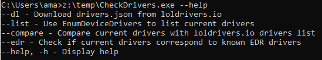
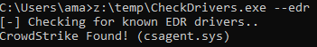

# CheckDrivers

----

Tool permitting to:
- Display the list of currently installed drivers (along with vendor) using EnumDeviceDrivers() 
- Check for installed EDR based on drivers name
- Check for existing vulnerable drivers based on <loldrivers.io>

## Usage

## Example

